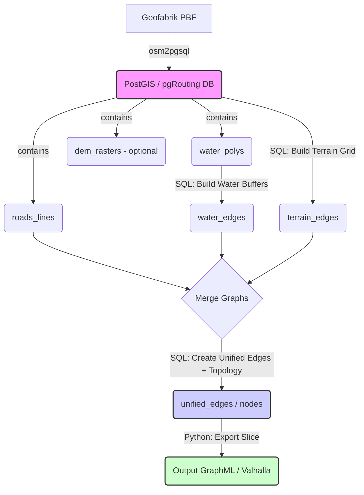

# Terrain Graph Pipeline Architecture

This document outlines the architecture of the terrain graph pipeline project.

## Overview

This project creates a scalable pipeline for producing terrain-aware routing graphs from OpenStreetMap data, water features, and potentially digital elevation models (DEMs). The primary outputs are a master PostGIS database containing the graph network and on-demand slices exported in formats like GraphML or Valhalla tiles.

## Core Technologies

- **Database:** PostgreSQL with PostGIS and pgRouting extensions
- **Data Ingestion:** osm2pgsql (likely with a flex config)
- **Pipeline Orchestration:** Python (using Typer, SQLAlchemy/GeoAlchemy2, NetworkX)
- **Containerization:** Docker and Docker Compose

## Pipeline Flow Diagram

(Adapted from root README.md - Represents the *Terrain Graph Pipeline*)

## Identified Pipeline Workflows

Based on script analysis and documentation, there appear to be at least two distinct pipeline workflows within this project:

1.  **Standard/Enhanced Terrain Graph Pipeline:**
    *   **Goal:** Create a unified, routable graph network (`unified_edges`, `unified_nodes`) incorporating road networks, terrain costs, and water feature avoidance.
    *   **Primary Scripts:** `scripts/run_pipeline_enhanced.py` (preferred), `scripts/reset_database.py`.
    *   **Orchestration:** Can be run directly or via `scripts/run_unified_pipeline.py --pipeline enhanced`.
    *   **Key Steps:** Loads OSM data (`osm2pgsql`), derives road/water features, builds *non-dissolved* water buffers (`water_buf` table via `sql/build_water_buffers_simple.sql`), creates a terrain grid (`terrain_grid` table via `sql/build_terrain_grid_simple.sql`), creates corresponding edges, merges them, and builds topology.
    *   **Key Outputs:** `unified_edges`, `unified_nodes` tables in PostGIS, exportable slices (GraphML, Valhalla).
    *   *Note:* The "Enhanced" variant uses specific SQL scripts (`*_enhanced_*.sql`) to preserve more OSM attributes and potentially use different cost calculations compared to the older "Standard" variant.

2.  **Water Obstacle Pipeline:**
    *   **Goal:** Likely focuses on modeling water bodies as obstacles or analyzing crossing points, potentially for different types of movement or planning scenarios.
    *   **Primary Scripts:** Appears to use scripts located in `planning/scripts/` (e.g., `run_water_obstacle_pipeline.py`), invoked via `scripts/run_unified_pipeline.py --pipeline water`.
    *   **Key Steps:** Processes water features differently. Notably, it seems responsible for creating *dissolved* water buffers (`water_buf_dissolved` table). The exact processing steps require further investigation of the scripts in `planning/`.
    *   **Key Outputs:** `water_buf_dissolved`, `water_features`, potentially other analysis tables.

**Important:** The pipeline run executed on 2024-05-16 (`python scripts/run_pipeline_enhanced.py`) corresponds to the **Enhanced Terrain Graph Pipeline**. It created the initial `water_buf` (non-dissolved) and `terrain_grid` tables as part of *that* workflow.

## High-Level Workflow (Terrain Graph Pipeline)

The primary workflow for the Terrain Graph Pipeline involves the following steps, typically orchestrated by Python scripts in the `scripts/` directory:

1.  **Setup:** Start Docker containers (`docker compose up`) and set up the Python environment.
2.  **(Optional) Data Subsetting:** Use `scripts/extract_osm_subset.py` to create a smaller PBF file from a larger source for testing or development.
3.  **Database Reset & Data Load:** Use `scripts/reset_database.py` with the `--reset-all` and `--import <path_to.osm.pbf>` flags. This script drops existing tables and uses `osm2pgsql` (likely configured via environment variables or a config file) to load the OSM data into core tables (e.g., `planet_osm_line`, `planet_osm_polygon`).
4.  **Pipeline Execution:** Run `scripts/run_pipeline.py` (or potentially `scripts/run_pipeline_enhanced.py` for preserving more attributes). This script executes a series of SQL commands (located in the `sql/` directory) to:
    *   Derive initial road and water feature tables.
    *   Build buffered polygons around water features.
    *   Generate a terrain grid (likely hexagonal) covering the area, potentially incorporating DEM data for slope costs (though the simple version uses placeholder costs).
    *   Create edge representations for roads, water buffer boundaries, and the terrain grid.
    *   Merge these edges into a unified graph table (`unified_edges`).
    *   Build network topology using `pgr_createTopology` or similar pgRouting functions on the `unified_edges` table, creating vertices (nodes) at intersections.
5.  **Export/Analysis:** Use scripts like `tools/export_slice.py`, `scripts/export_slice_with_attributes.py`, or `visualize_graph.py` to extract specific regions of the graph (e.g., based on drive time) into formats like GraphML for use in external tools or analysis.

## Key Directories

-   **`/`**: Root directory containing Docker config, Makefiles, READMEs, main requirements.
-   **`scripts/`**: Python scripts for pipeline orchestration, data loading, subsetting, analysis.
-   **`sql/`**: SQL scripts executed by the pipeline for data transformation and graph building.
-   **`utils/`**: Common utility functions (currently minimal).
-   **`tools/`**: Helper scripts, potentially for export or specific tasks.
-   **`docs/`**: Detailed documentation files.
-   **`architecture/`**: Contains this file and `worklog.md`.
-   **`data/`**: Input data storage (e.g., PBF files).
-   **`output/`**: Default location for exported graphs or analysis results.
-   **`deprecated/`**: Older or unused code.

## Open Questions / Areas for Clarification

-   Confirm exact `osm2pgsql` configuration (flex style file, tag transforms).
-   Detail the DEM integration process and slope cost calculation (if implemented beyond placeholders).
-   Clarify the exact differences between `run_pipeline.py` (deprecated standard) and `run_pipeline_enhanced.py` (active enhanced).
-   Confirm the status of `scripts/run_unified_delaunay_pipeline.py` (recommend moving to `deprecated/`).
-   Verify database connection details management (likely environment variables for Docker).
-   Fully detail the steps and purpose of the "Water Obstacle Pipeline" by examining the scripts in `planning/`. 