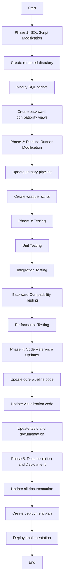

# Table Naming Implementation Plan Overview

This document provides a high-level overview of the implementation plan for the Pipeline Stage Prefixing naming convention.

## Implementation Phases

The implementation is divided into five phases:

1. **SQL Script Modification**: Modify all SQL scripts to use the new table naming convention
2. **Pipeline Runner Modification**: Update the pipeline runner to use the modified scripts
3. **Testing**: Test the implementation to ensure it works correctly
4. **Code Reference Updates**: Update all code references to use the new table names
5. **Documentation and Deployment**: Update all documentation and deploy the implementation

## Implementation Diagram

## Key Components

### 1. SQL Script Modification

- Create the `renamed` directory in `epsg3857_pipeline/core/sql/`
- Modify each SQL script to use the new table naming convention
- Create the backward compatibility views script

### 2. Pipeline Runner Modification

- Update the primary pipeline to support both the old and new table naming conventions
- Create a wrapper script for the renamed tables pipeline
- Test the updated pipeline

### 3. Testing

- Create and run unit tests for each script
- Create and run integration tests for the entire pipeline
- Create and run backward compatibility tests
- Create and run performance tests
- Fix any issues that arise

### 4. Code Reference Updates

- Identify all code that references the old table names
- Update the code to use the new table names
- Test the updated code

### 5. Documentation and Deployment

- Update all documentation to use the new table names
- Create a deployment plan
- Deploy the implementation
- Monitor the deployment for any issues

## Backward Compatibility

To maintain backward compatibility with existing code, the implementation includes:

1. **Backward Compatibility Views**: Create views with the old table names that point to the new tables
2. **Pipeline Flag**: Add a `--use-renamed-tables` flag to the pipeline runner to control whether to use the renamed tables
3. **Wrapper Script**: Create a wrapper script for the renamed tables pipeline

## Testing Strategy

The testing strategy includes:

1. **Unit Testing**: Test each script individually
2. **Integration Testing**: Test the entire pipeline
3. **Backward Compatibility Testing**: Test that existing code works with the backward compatibility views
4. **Performance Testing**: Test that the performance is not significantly affected

## Implementation Timeline

The implementation will be completed over a 14-day period:

- **Days 1-4**: SQL Script Modification
- **Day 5**: Pipeline Runner Modification
- **Days 6-9**: Testing
- **Days 10-12**: Code Reference Updates
- **Days 13-14**: Documentation and Deployment

## Success Criteria

The implementation will be considered successful if:

1. All SQL scripts are modified to use the new table naming convention
2. The pipeline runner supports both the old and new table naming conventions
3. All tests pass
4. All code references are updated to use the new table names
5. All documentation is updated to use the new table names
6. The implementation is deployed successfully

## Conclusion

This implementation plan provides a comprehensive approach for implementing the Pipeline Stage Prefixing naming convention. By following this plan, we can ensure a smooth transition to the new naming convention while maintaining backward compatibility with existing code.